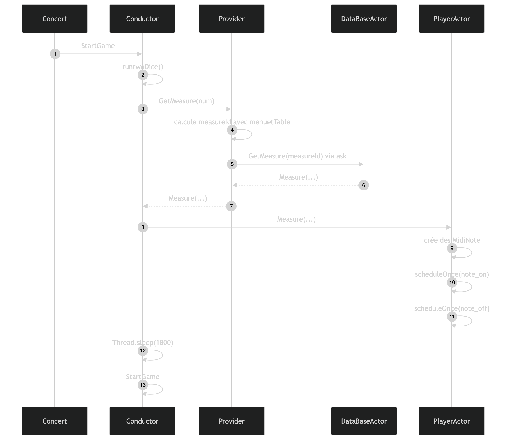

# TME 11 - AKKA

## Introduction
Ce projet est une implementation du jeu des dès de Mozart a l'aide du princide de l'actor model.

## Installation

```
sbt compile
sbt run
```

## Architecture

Voici l'organisation des acteurs après `ActorSystem` dans notre projet :


* `Conductor` est l'acteur principal. Il lance les dés, demande une mesure au `Provider`, l'envoie au `Player`, puis relance un nouveau tour.

* `Provider` reçoit le résultat des dés, calcule l'identifiant de la mesure à partir de la table de Mozart, puis interroge `DataBase`.

* `DataBase` contient les mesures musicales et renvoie la `Measure` demandée.

 * `Player` reçoit la mesure et joue les notes en MIDI.

## Comment les acteurs communiquent-ils ?

"*Conductor reçoit un message StartGame, puis lance deux dés et envoie un message GetMeasure (result) au
Provider où result est la somme des deux dès. Provider enverra un message à Conductor avec la mesure
qu’il y a obtenue grâce aux deux tables. Il communiquera avec l’acteur DataBase pour trouver la bonne
mesure.*"

## Auteurs
upmc

Noé Breton